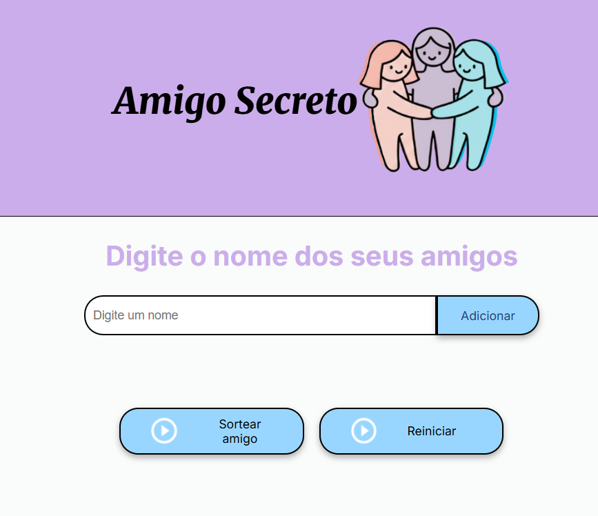

# Amigo Secreto

Projeto desenvolvido como parte do **Challenge Amigo Secreto** do programa ONE (Oracle Next Education). A ideia é criar uma aplicação simples para organizar sorteios de **amigo secreto**.

## Tecnologias utilizadas
- **HTML5**
- **CSS3**
- **JavaScript**

## Como executar

1. Clone este repositório:
   ```bash
   git clone https://github.com/a-odt/Amigo-Secreto.git
   ```
   
2. Abra o arquivo index.html no navegador

## Funcionalidades
- Adicionar nomes de amigos à lista.
- Listar os participantes cadastrados.
- Sortear os pares de amigo secreto de forma aleatória.
- Interface simples e intuitiva para o usuário.

## Design



## Autores
- [@a-odt](https://github.com/a-odt)

